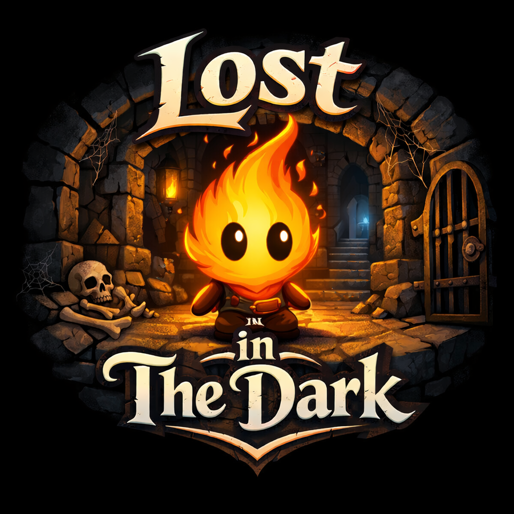

# Lost In The Dark

<p align="center">
  
</p>

## Overview

This is a top-down game for my CSCI319 class, where your character is a torch that will use light to find its way on different levels.


## Requirements

```bash

pip install -r requirements.txt

```


## Credits

[Dungeon asset pack](https://pixel-poem.itch.io/dungeon-assetpuck)

Some code has been refactored from Professor. Liz Matthews

[fire elemental pack](https://elthen.itch.io/2d-pixel-art-fire-elemental)

[ambient music](https://pixabay.com/sound-effects/film-special-effects-a-dungeon-ambience-loop-79423/)

[flame music](https://freesound.org/)

## Remaining Work

- Win condition for Level 1 and Level 3 
- New puzzle mechanics: ice block melted by fireball / torch sequence / shadow block
- Build Level 3 map and deploy puzzles and enemies
- Second enemy type or final boss using existing sprites
- General polish and final touches